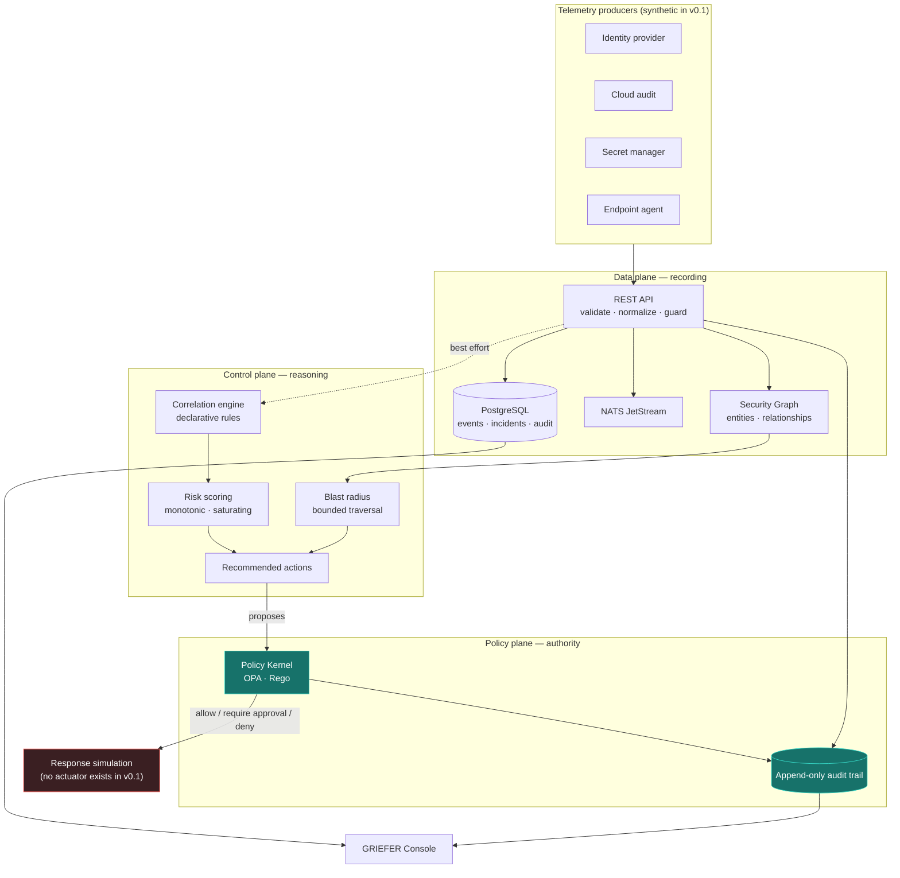

# GRIEFER

**G**raph-based **R**esilient **I**ntelligence **E**ngine for **E**nforcement & **R**esponse

> **See the attack. Contain the blast. Prove the defense.**

[](https://github.com/kamilxgriefer/griefer-security-platform/actions/workflows/ci.yml)
[](https://github.com/kamilxgriefer/griefer-security-platform/actions/workflows/codeql.yml)
[](LICENSE)
[](go.mod)

---

## Status: v0.1 — early prototype

GRIEFER is an ambitious research and engineering project exploring verifiable,
policy-governed cyber defense.

It is **not** a product, and it is not ready to defend anything. What exists
today is a working foundation: telemetry goes in, weak signals are correlated
into an incident, a blast radius is estimated from a graph, and every proposed
response is judged by a policy engine that logs its reasoning.

**Response actions are simulated.** GRIEFER v0.1 contacts no identity provider,
no endpoint agent and no cloud platform. There is no actuator in the codebase.
That is enforced by control flow and covered by tests, not promised in prose —
see [`docs/SAFETY_MODEL.md`](docs/SAFETY_MODEL.md).

All demonstration data is synthetic. See [`fixtures/synthetic/`](fixtures/synthetic/).

---

## The problem

Most organisations already collect enough telemetry to have caught the intrusion
that eventually hurt them. The failure is rarely a missing log. It is that the
evidence arrived as a dozen unremarkable events, in four different tools, on
three different days, and nobody could see that they were one story.

Then, having seen it, the responder faces a second problem: the containment step
that would stop the attack is the same step that locks out a real employee if
the read was wrong — and there is usually no record of why anyone decided it was
worth the risk.

GRIEFER is an attempt at both halves:

1. **Correlate** weak signals across sources into a single attack narrative,
   attached to the identity that persists while hosts and tokens change.
2. **Govern** every response with a policy engine that is separate from the
   detection logic, refuses destructive actions, requires a human where a
   mistake would be expensive, and writes down its reasoning either way.

## Design commitments

These are the properties the code is built to hold. Each is testable, and each
has tests.

| Commitment | What it means in the code |
|---|---|
| **Detection proposes, policy disposes** | The correlation engine can only *recommend*. Every action passes through the Policy Kernel; no amount of detection logic can talk itself into acting. |
| **Fail closed** | An unreachable Policy Kernel denies. `Evaluate()` returns a valid denial even on error, so a caller that ignores the error is still safe. |
| **Recording survives reasoning** | An event is durably stored *before* anything analyses it. A crashed correlation engine degrades analysis, never capture. |
| **Telemetry is data, never instruction** | Unknown fields are refused by schema; control-plane label keys are stripped and the attempt is logged. Action properties come from a server-side catalog, never from input. |
| **Corroboration before automation** | Automated response requires at least two *independent* evidence categories. Repetition inside one category is capped and does not count as confirmation. |
| **Honest metadata** | An action is "reversible" only if a rollback exists. Nothing may claim reversibility to slip past the approval gate. |
| **Every decision is explained** | A decision with no reason is rejected as malformed. Every decision writes an audit entry. |

## Architecture



The single most important edge in that diagram is `REC -->|proposes| PK`. There
is no path from the correlation engine to an effect that does not pass through
the Policy Kernel. Full detail in [`docs/ARCHITECTURE.md`](docs/ARCHITECTURE.md).

## The demonstration scenario

Five synthetic events against a fictional company, replayed through the real
ingest API. No step is alarming on its own; the point is what they add up to.

| # | Event | Evidence category | Risk after |
|---|---|---|---|
| 1 | Sign-in from an address never seen for this identity | `authentication` | **24** |
| 2 | Privileged session established | `session_anomaly` | **33** |
| 3 | Directory role assignment changed | `privilege_escalation` | **50** |
| 4 | Application secret retrieved | `credential_access` | **66** |
| 5 | Access attempt against a critical archive (denied) | `cloud_access` | **81** |

At step 1 GRIEFER has one weak signal and the Policy Kernel refuses to isolate
anything. By step 5 it has five independent evidence categories, a blast radius
reaching two critical assets through the asset inventory, and containment that
policy will allow to run — in simulation.

The Policy Kernel then splits the recommended actions three ways:

| Action | Verdict | Why |
|---|---|---|
| `preserve_evidence` | **allow** | Non-destructive, reversible, corroborated |
| `isolate_endpoint` | **allow** | Reversible with a defined rollback, five evidence categories |
| `require_mfa` | **allow** | Reversible, low blast radius |
| `revoke_sessions` | **require approval** | A revoked token cannot be un-revoked |
| `rotate_exposed_secret` | **require approval** | Irreversible *and* targets a critical asset |
| `wipe_endpoint` | **deny** | Destructive — refused in every mode, to anyone |

Walkthrough with expected output: [`docs/ATTACK_SCENARIOS.md`](docs/ATTACK_SCENARIOS.md).

## Quick start

**Requirements:** Docker with Compose v2. Nothing else — the images carry their
own toolchains. About 2 GB of disk and 2 GB of RAM.

```bash
git clone https://github.com/kamilxgriefer/griefer-security-platform.git
cd griefer-security-platform
make secrets
make up
make demo
```

Then open **<http://localhost:3000>** and sign in.

`make secrets` generates the console accounts and the service credentials into
`.env.local`, which `make up` requires and which is never committed. The two
passwords are written to `~/.config/griefer/demo-credentials.txt` with mode 600
and are deliberately not printed — not to the terminal, not to a log.

You sign in as **`admin`** (sees everything, including the audit trail and the
account list) or as **`analyst`** (dashboard and incidents only). There is no
sign-up: accounts are provisioned, never self-registered. See
[docs/ACCESS_CONTROL.md](docs/ACCESS_CONTROL.md).

`.env.example` documents the full set of variables with placeholder values. It
is a reference, not a working configuration — copying it produces a console that
refuses every login, because its credentials are deliberately unusable.

`make up` starts PostgreSQL, NATS JetStream, OPA, the API and the console. Every
port is published to `127.0.0.1` only. `make demo` replays the synthetic scenario
through the real ingest API — it is not a fixture loaded behind the scenes.

```bash
make demo-slow   # three-second pauses, to watch the risk score climb
make logs        # follow the stack
make down        # stop and remove volumes
```

### Without Docker

Requires Go 1.25+, Node 22+, pnpm, plus `postgresql@17`, `nats-server` and `opa`
on `PATH`.

```bash
make services-up            # native PostgreSQL, NATS and OPA
make build-api
GRIEFER_STORAGE_POSTGRES=true \
GRIEFER_POSTGRES_DSN="postgres://griefer@127.0.0.1:55432/griefer_test?sslmode=disable" \
GRIEFER_NATS_ENABLED=true GRIEFER_NATS_URL="nats://127.0.0.1:54222" \
GRIEFER_OPA_URL="http://127.0.0.1:58181" \
  ./bin/griefer-api
```

The API also runs with no dependencies at all — in-memory storage and the
embedded Policy Kernel evaluating the same Rego:

```bash
make build-api && ./bin/griefer-api
```

## Tests

```bash
make test           # Go suite, race detector on
make policy-check   # opa check + opa test over the Rego policy
make test-console   # console suite
make check          # every gate: format, vet, policy, Go, lint, typecheck, console
```

Against real infrastructure rather than in-process substitutes:

```bash
make services-up && make test-live
```

The safety contract has its own suite, one test per guarantee:

```bash
go test -run TestSafetyContract ./tests/integration/ -v
```

## The safe-automation model

Automation is gated on evidence, reversibility and blast radius — never on
confidence alone.

1. A single weak signal can never trigger automated containment.
2. Automated response requires **two independent evidence categories**. Ten
   sign-in anomalies for one identity are one observation restated.
3. Destructive actions are denied unconditionally, in every mode, to everyone.
4. An action with no defined rollback requires human approval.
5. An action touching a critical asset requires human approval.
6. Dry-run may proceed automatically when nothing above fires.
7. Every decision carries a human-readable reason.
8. An unreachable Policy Kernel denies. It never means "probably fine".
9. A degraded correlation engine must not stop telemetry being captured.
10. Telemetry can never carry an executive instruction into the platform.

Rationale and the autonomy-level ladder: [`docs/SAFETY_MODEL.md`](docs/SAFETY_MODEL.md).

## What v0.1 does not do

Stated plainly, because a security tool that overstates itself is worse than no
tool.

- **No real response.** No actuator exists. `mode: execute` is accepted so the
  policy contract can be exercised, and always resolves to "requires approval".
- **No authentication or authorization.** The API binds loopback and refuses a
  public interface unless explicitly overridden. Do not expose it. → M8
- **Tamper-resistant audit, not tamper-evident.** Append-only by interface and by
  database trigger; a role with DDL rights can still rewrite history. Hash
  chaining is → M4
- **The Security Graph is in memory** and rebuilt on start. → M2
- **No real connectors.** Every event is synthetic. → M4, M5
- **OCSF-inspired, not OCSF-conformant.** The event schema borrows the OCSF
  layout; no conformance testing has been done and none is claimed. → M6
- **Sigma rules are published, not evaluated.** They are export content for
  external SIEM/EDR, validated for well-formedness by CI.
- **Identity-first correlation only.** Events with no attributable actor are
  grouped by source rather than merged into someone else's incident.
- **Single node.** No horizontal scaling, no HA, no multi-tenancy.

## Roadmap

| | Milestone | State |
|---|---|---|
| **M0** | Foundation — schema, storage, API, audit | ✅ v0.1 |
| **M1** | Event ingestion and normalization | ✅ v0.1 |
| **M2** | Correlation and persistent Security Graph | ◐ in-memory in v0.1 |
| **M3** | Policy-governed response | ◐ simulation in v0.1 |
| **M4** | Identity integration (read-only Entra ID) + tamper-evident audit | ○ next |
| **M5** | Endpoint telemetry and native Sigma evaluation | ○ |
| **M6** | Continuous defense validation + OCSF conformance | ○ |
| **M7** | AI-assisted investigation, strictly outside the policy path | ○ |
| **M8** | Production hardening — authentication, RBAC, HA | ○ |

Detail: [`docs/ROADMAP.md`](docs/ROADMAP.md).

## Documentation

| Document | Contents |
|---|---|
| [VISION.md](docs/VISION.md) | Where this is going and why it is shaped this way |
| [ARCHITECTURE.md](docs/ARCHITECTURE.md) | Components, event flow, trust boundaries, failure modes |
| [THREAT_MODEL.md](docs/THREAT_MODEL.md) | Attacks against GRIEFER itself, and what is done about them |
| [SAFETY_MODEL.md](docs/SAFETY_MODEL.md) | Autonomy levels, approval, rollback, break-glass |
| [DATA_MODEL.md](docs/DATA_MODEL.md) | Entities, schema versioning, the OCSF relationship |
| [ATTACK_SCENARIOS.md](docs/ATTACK_SCENARIOS.md) | The lab scenario, step by step |
| [ROADMAP.md](docs/ROADMAP.md) | Milestones and their acceptance criteria |
| [adr/](docs/adr/) | Architecture decision records |
| [api/openapi.yaml](api/openapi.yaml) | REST API contract |

## Responsible use

GRIEFER is defensive software. It ingests telemetry, reasons about it, and
proposes containment. It contains no exploit code, no credential harvesting, no
persistence mechanism, no evasion technique and no offensive automation, and
contributions adding any of those will be declined.

The scenarios in this repository describe attacker behaviour only at the level of
detail needed to explain what GRIEFER detects. They are not instructions, and
they target a fictional environment.

Run GRIEFER only against systems you are authorised to defend. Automated response
acts on real people's access: read [`docs/SAFETY_MODEL.md`](docs/SAFETY_MODEL.md)
before enabling anything beyond simulation in a future version.

## Reporting a vulnerability

Please **do not** open a public issue for a security problem. See
[SECURITY.md](SECURITY.md) for private reporting via GitHub Security Advisories,
scope and expected response times.

## Contributing

See [CONTRIBUTING.md](CONTRIBUTING.md). In short: every safety-relevant change
needs a test that fails without it, `make check` must pass, and a change that
weakens a guarantee in the safe-automation model needs an ADR explaining why.

## License

Apache License 2.0 — see [LICENSE](LICENSE).
