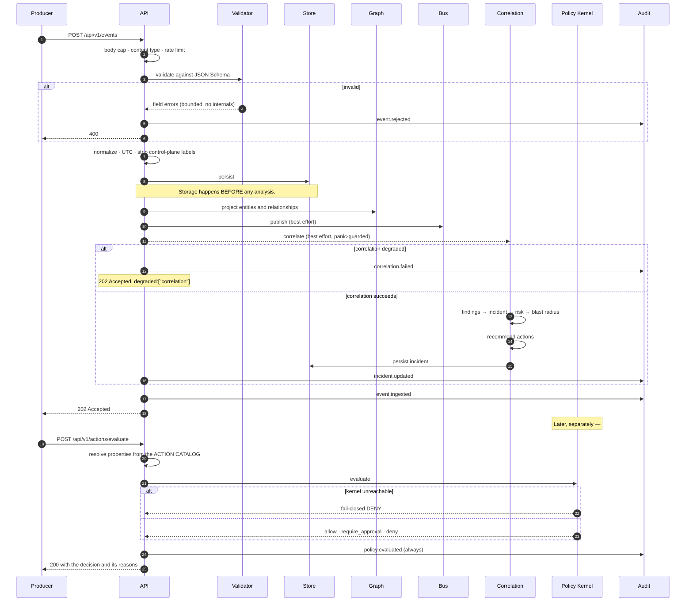
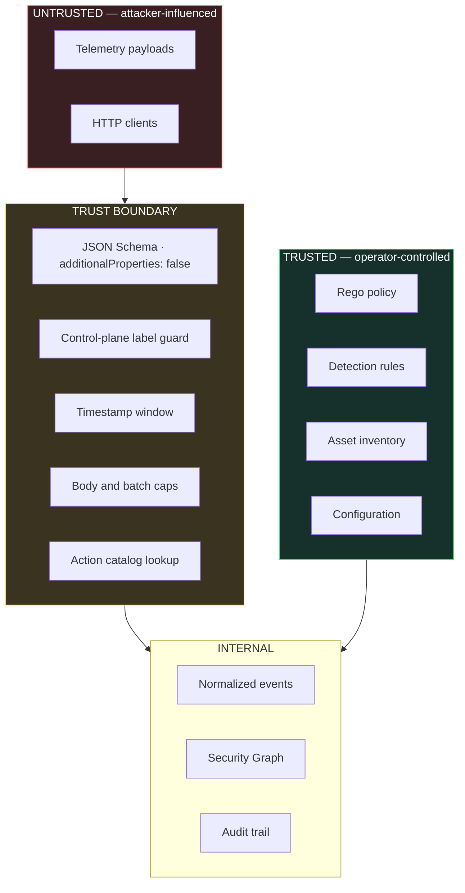
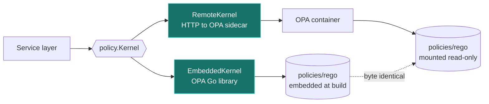

# Architecture

GRIEFER v0.1 is a **modular monolith**: one Go binary, clear internal package
boundaries, no microservices. The boundaries are enforced by Go's package system
and by the interfaces components depend on, so any of them could later become a
service without redesign — but distributing a system before its boundaries have
settled buys operational complexity in exchange for nothing.

---

## Planes

GRIEFER separates three concerns, and the separation is the security argument.

```mermaid
flowchart LR
    subgraph DP["DATA PLANE — recording"]
        direction TB
        D1["Ingest · validate · normalize"]
        D2["Persist"]
        D3["Project into the graph"]
        D4["Publish"]
    end

    subgraph CP["CONTROL PLANE — reasoning"]
        direction TB
        C1["Correlate into findings"]
        C2["Score risk"]
        C3["Estimate blast radius"]
        C4["Recommend actions"]
    end

    subgraph PP["POLICY PLANE — authority"]
        direction TB
        P1["Evaluate against Rego"]
        P2["Allow · require approval · deny"]
        P3["Record the decision"]
    end

    DP -->|best effort| CP
    CP -->|proposes, never decides| PP
    PP -->|only path to any effect| EFF["Simulated effect<br/>(no actuator in v0.1)"]

    classDef data fill:#101319,stroke:#38d9c8,color:#e7ecf3
    classDef ctrl fill:#101319,stroke:#ffd166,color:#e7ecf3
    classDef pol fill:#17726a,stroke:#38d9c8,color:#fff
    class DP data
    class CP ctrl
    class PP pol
```



**Data plane** records what happened. It must keep working when everything above
it is broken — an attacker who can crash the analysis path must not thereby stop
GRIEFER from recording what they did.

**Control plane** decides what it *means*. It may fail. When it does, ingestion
continues, the failure is audited, and the events remain available for
reprocessing.

**Policy plane** decides what may be *done*. It is the only path to any effect,
and it fails closed.

The arrow `CP -->|proposes, never decides| PP` is the load-bearing one. It is
enforced by construction: `internal/correlation` produces
`incidents.RecommendedAction` values and has no dependency on `internal/policy`
at all. It could not act if it wanted to.

## Packages

```
cmd/griefer-api/       Wiring, lifecycle, graceful shutdown
cmd/griefer-seed/      Replays a synthetic scenario through the real HTTP API

internal/
  api/        HTTP surface + the service layer that orchestrates ingest and evaluation
  httpx/      Request identity, body caps, rate limiting, panic recovery, error envelope
  events/     SecurityEvent, JSON Schema validation, normalization, control-plane guard
  graph/      Security Graph: entities, edges, projection, blast-radius traversal
  correlation/ Declarative rule evaluation, finding→incident merge, recommendations
  risk/       Risk scoring, severity, confidence
  incidents/  Findings, incidents, response actions, the ACTION CATALOG
  policy/     Policy Kernel: embedded and remote OPA, fail-closed contract
  audit/      Append-only decision trail
  storage/    Store interface + in-memory and PostgreSQL implementations
  bus/        NATS JetStream publisher, degrades to a no-op
  config/     Environment configuration with eager validation
  demo/       Synthetic fixture loading and timestamp rebasing
  idgen/      Time-ordered public identifiers

schemas/      JSON Schema for the wire format (embedded)
policies/     Rego source (embedded, and mounted into the OPA sidecar)
detections/   Correlation rules and Sigma export content (embedded)
fixtures/     Synthetic demo data (embedded)
```

Dependencies point inward. `internal/api` knows about everything; `internal/events`
knows about nothing but `internal/idgen`. No package imports `internal/api`.

### Why the action catalog lives in `internal/incidents`

Every safety-relevant property of a response action — destructive, reversible,
what rolls it back, whether it is isolation-class — is defined in exactly one
place: `internal/incidents/catalog.go`.

Callers supply an action *name*. They never supply its properties. That inversion
is what stops `"reversible": true` from being something an attacker, a buggy
client, or a future AI component can simply assert. It is also why the catalog
defines destructive actions it will never recommend: the deny path is then
exercised by real input rather than by a test double.

## Event flow



Steps 5–7 are the ordering guarantee. An event is durable before anything reasons
about it, and both the bus and correlation are best-effort. This is covered by
`TestTelemetryCaptureSurvivesADegradedCorrelationEngine`, which injects both a
failing and a panicking correlator and asserts the event still lands in storage.

## Trust boundaries



**Everything from a producer is attacker-influenced.** A compromised sensor, a
forged request or a hostile application can put anything in an event. Five
controls sit on that boundary:

| Control | What it stops | Where |
|---|---|---|
| `additionalProperties: false` | Fields the schema does not know are rejected outright — there is no smuggling channel | `schemas/events/*.json` |
| Control-plane label guard | Label keys naming a GRIEFER concept are stripped and the attempt is audited | `internal/events/guard.go` |
| Timestamp window | A far-future timestamp cannot keep an incident artificially current; an old one cannot be replayed into a live incident | `internal/events/normalize.go` |
| Body and batch caps | A small body can still hold thousands of tiny events, so both are bounded | `internal/httpx`, `internal/api` |
| Action catalog lookup | Action properties are resolved server-side; a client naming an action cannot describe it | `internal/incidents/catalog.go` |

**Policy, detection rules and the asset inventory are trusted** — they come from
the operator, through code review, not over the network. Rules can only reference
an allowlisted set of event fields, so even a mistaken rule cannot be pointed at
data it was not designed to read.

## The Policy Kernel

Two implementations, one policy.



`EmbeddedKernel` keeps the platform enforceable as a single process — tests, CI
and single-binary deployments evaluate real Rego with no sidecar.
`RemoteKernel` is the Compose deployment shape, so policy can be reloaded and
audited independently of the binary. The Compose stack mounts `policies/rego`
**read-only**: the Policy Kernel's rules are not something the platform should be
able to rewrite at runtime.

`TestAgainstLiveServices` asserts that the remote kernel returns the same verdicts
as the embedded one, and that the sidecar reports the same `policy_version` the
binary embeds — catching the case where the two have silently diverged.

### The fail-closed contract

```go
// Evaluate returns the policy decision for in.
//
// The returned decision is ALWAYS safe to act on, including when err is
// non-nil: on any failure the decision is a fail-closed deny.
Evaluate(ctx context.Context, in Input) (incidents.PolicyDecision, error)
```

Returning a valid denial *alongside* the error means a caller that forgets to
check `err` still cannot act. The error is returned as well, because a degraded
kernel is an operational signal that belongs in logs and metrics — but safety
does not depend on anyone reading it.

## Failure modes

| Failure | Effect | Recovery |
|---|---|---|
| **PostgreSQL down** | Ingestion returns 500 — an event GRIEFER cannot durably store must not be acknowledged. `/ready` is 503. | Restore the database. Producers retry; `SaveEvent` is idempotent on event id. |
| **NATS down** | Ingestion continues. Response carries `degraded: ["event_bus"]`. Metric `griefer_bus_publish_errors_total` rises. | Automatic on reconnect. |
| **OPA down** | Ingestion unaffected. Every response action is denied with `fail_closed: true` and the `X-Griefer-Policy-Degraded` header. `/ready` is 503. | Restart OPA. |
| **Correlation fails or panics** | Event is stored; response carries `degraded: ["correlation"]`; `correlation.failed` is audited. The panic is contained — it does not reach the HTTP handler. | Fix the rule; reprocess stored events. |
| **A detection rule is wrong** | Bad findings, wrong risk. Policy still refuses destructive actions and still requires corroboration. | Correct the rule; incidents recompute from evidence. |
| **Policy bundle replaced with a malformed one** | Unrecognised effect or missing reasons → `toDecision` rejects it → deny. | Restore the policy; startup health check catches it before serving. |
| **Audit write fails** | The operation completes and the failure is logged loudly. Whether to proceed without an audit record is the caller's decision, not the recorder's. | Restore storage. Gaps are visible as sequence discontinuities in PostgreSQL. |
| **A producer floods the API** | Rate limited per client address. Bodies and batches capped. In-memory store bounds retention. | Automatic. |
| **A producer sends control-plane labels** | Stripped, audited as `event.label_quarantined`, event otherwise accepted. | None needed — the attempt is now a signal. |

## Scaling beyond one node

Not implemented, and the shape is already constrained by what exists:

**Stateless API.** The service layer holds no request state. Multiple API
instances behind a load balancer work today for ingestion — except for two pieces
of in-process state:

- **The Security Graph** is per-process. → M2 moves it into PostgreSQL, with the
  in-memory graph becoming a read-through cache.
- **Correlation subject state** (which incident is absorbing a subject's findings,
  and threshold-rule counters) is per-process. → M2 moves subject leasing into the
  database so a subject is correlated by exactly one instance at a time.

**NATS JetStream is already the seam.** Ingestion publishes; correlation could
consume. Splitting them is a deployment change, not a redesign — which is why the
publisher exists in v0.1 even though nothing consumes it yet.

**PostgreSQL first, then partition.** The current schema stores indexed scalar
columns plus a JSONB document, which is honest for a moving model and will not
survive real volume. M2 normalises entities and edges; time-partitioning
`security_events` comes with the first deployment that needs it.

**OPA scales trivially** — it is stateless and its decisions are pure functions of
input and policy.

The order matters: persistent graph → distributed correlation → partitioned
storage. Doing them in a different order produces a system that is distributed
and still wrong.
