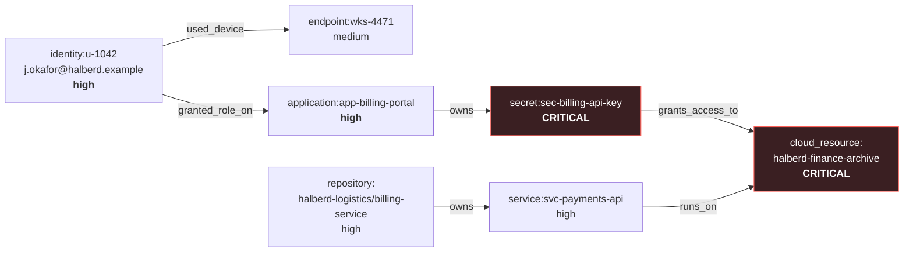

# Attack scenarios

Controlled laboratory scenarios used to exercise and demonstrate GRIEFER.

---

## Scope and responsible use

**Everything here is synthetic.** A fictional organisation, RFC 2606
documentation domains, RFC 5737 TEST-NET addresses, invented identifiers. No file
in this repository contains a credential value, real or fabricated.

These scenarios describe attacker behaviour **only at the level of detail needed
to explain what GRIEFER detects and why**. They are not instructions. There is no
exploit code, no tooling, no evasion technique and no operational tradecraft here,
and none will be added.

Run scenarios **only against systems you own or are explicitly authorised to
test**. When GRIEFER gains real response capability, running it against systems
you do not control could disable someone else's access — with the same legal
consequences as any other unauthorised action.

---

## Scenario 01 — Identity compromise reaching a critical archive

**File:** [`fixtures/synthetic/scenario-01-identity-compromise.json`](../fixtures/synthetic/scenario-01-identity-compromise.json)
**Replay:** `make demo`

### The fictional environment

**Halberd Logistics**, a mid-size company. From
[`fixtures/synthetic/asset-inventory.json`](../fixtures/synthetic/asset-inventory.json):



The chain that matters is `identity → application → secret → archive`. It exists
in the **inventory**, not in the telemetry. That is what lets GRIEFER answer *what
does this unlock* rather than only *what was touched*.

### The chain

Each step is individually unremarkable. That is the entire point.

| # | Event | Category | Why it is weak alone |
|---|---|---|---|
| 1 | Sign-in from an address never seen for this identity | `authentication` | Travel, a new office, a VPN change all look identical |
| 2 | Privileged session established | `session_anomaly` | Expected during normal administrative work |
| 3 | Directory role assignment changed | `privilege_escalation` | Access reviews and JIT elevation do this legitimately |
| 4 | Application secret retrieved | `credential_access` | Applications read their own secrets constantly |
| 5 | Access attempt against a critical archive — **denied** | `cloud_access` | A denied request is often just a misconfiguration |

Step 5 is recorded **regardless of outcome**. A denied attempt against a
crown-jewel asset is strong evidence of intent, and a platform that only records
successes misses the most informative moment in the chain.

### What GRIEFER does, step by step

```
[1/5] evt-…39ad  →  incident inc-…0ebe  risk 24
[2/5] evt-…02cf  →  incident inc-…0ebe  risk 33
[3/5] evt-…63b5  →  incident inc-…0ebe  risk 50
[4/5] evt-…a5ff  →  incident inc-…0ebe  risk 66
[5/5] evt-…65f5  →  incident inc-…0ebe  risk 81
```

One incident, not five alerts. Risk rises monotonically, and each rise is
explained by a specific new category of evidence rather than by a model nobody can
interrogate.

**Final state:**

| | |
|---|---|
| Severity | `critical` |
| Risk score | **81** |
| Confidence | 95% (capped) |
| Findings | 5, one per rule |
| Evidence categories | 5 independent |
| ATT&CK | T1078, T1078.004, T1098, T1530, T1552.001 |
| Blast radius | **96** — 10 entities within 2 hops, 2 critical |

The blast radius reaches `service:svc-payments-api` and
`repository:halberd-logistics/billing-service` — neither of which appears in any
event. They are reachable through the inventory, which is exactly the question an
investigator needs answered and the one a telemetry-only view cannot.

### The Policy Kernel's verdicts

The correlation engine recommends six actions. Policy splits them three ways.

| Action | Verdict | Reason |
|---|---|---|
| `preserve_evidence` | ✅ **allow** | Non-destructive, reversible via `release_evidence_hold`, five categories, risk 81, simulate mode |
| `isolate_endpoint` | ✅ **allow** | Reversible via `release_endpoint_isolation`, corroboration bar met |
| `require_mfa` | ✅ **allow** | Reversible via `remove_mfa_requirement` |
| `temporarily_suspend_privileges` | ✅ **allow** | Reversible via `restore_privileges` |
| `revoke_sessions` | ⚠️ **require approval** | Not reversible — a revoked token cannot be un-revoked |
| `rotate_exposed_secret` | ⚠️ **require approval** | Not reversible **and** targets a critical asset |
| `wipe_endpoint` | ⛔ **deny** | Destructive — refused in every mode, to anyone |

Reproduce:

```bash
INC=$(curl -s 'http://localhost:8080/api/v1/incidents?limit=1' | jq -r '.items[0].id')

for a in preserve_evidence isolate_endpoint revoke_sessions rotate_exposed_secret wipe_endpoint; do
  curl -s -X POST http://localhost:8080/api/v1/actions/evaluate \
    -H 'Content-Type: application/json' \
    -d "{\"incident_id\":\"$INC\",\"action_type\":\"$a\",\"mode\":\"simulate\",\"automated\":true}" \
  | jq -r '"\(.action_type)\t\(.status)\t\(.policy_decision.reasons[0])"'
done
```

### The counterfactual — one signal only

The scenario is only convincing if the *absence* of corroboration changes the
answer. Submit step 1 alone:

```bash
curl -s -X POST http://localhost:8080/api/v1/events \
  -H 'Content-Type: application/json' \
  -d '{"schema_version":"0.1","timestamp":"'"$(date -u +%Y-%m-%dT%H:%M:%SZ)"'",
       "source_type":"identity_provider","source_name":"lab",
       "event_type":"user_signin","category":"authentication","severity":"medium",
       "actor":{"type":"identity","id":"u-5001"},
       "network":{"source_ip":"203.0.113.50","first_seen_for_actor":true}}'
```

Risk lands around 11. Ask to isolate the endpoint and policy refuses:

> Automated response requires at least 2 independent evidence categories; this
> incident has 1.
> Incident risk score 11 is below the automation threshold of 40.
> Isolation-class action "isolate_endpoint" cannot be triggered automatically by a
> single weak signal.

Three independent reasons, each naming a different rule. This is
`TestSafetyContract_SingleWeakSignalDoesNotIsolate`.

---

## Scenario 02 — Hostile telemetry

Not a fixture; a set of adversarial requests that belong in any evaluation of a
platform that ingests attacker-influenced data.

### 2a — Control-plane injection

A compromised producer tries to smuggle an instruction in a label:

```bash
curl -s -X POST http://localhost:8080/api/v1/events \
  -H 'Content-Type: application/json' \
  -d '{"schema_version":"0.1","timestamp":"'"$(date -u +%Y-%m-%dT%H:%M:%SZ)"'",
       "source_type":"application","source_name":"hostile-producer",
       "event_type":"user_signin","category":"authentication","severity":"low",
       "actor":{"type":"identity","id":"u-9999"},
       "labels":{"action":"isolate_endpoint","griefer_policy_override":"allow",
                 "command":"rm -rf /","note":"benign"}}'
```

```json
{
  "event_id": "evt-…",
  "quarantined_labels": ["action", "command", "griefer_policy_override"]
}
```

The event is **accepted** — dropping telemetry is itself a way to blind the
platform — with the control-plane keys stripped, `note` preserved, and an
`event.label_quarantined` audit entry written. The attempt becomes a signal.

### 2b — A structured instruction

```bash
curl -s -X POST http://localhost:8080/api/v1/events \
  -H 'Content-Type: application/json' \
  -d '{"schema_version":"0.1","timestamp":"2026-08-23T09:00:00Z",
       "source_type":"identity_provider","source_name":"hostile",
       "event_type":"user_signin","category":"authentication","severity":"low",
       "response_action":{"type":"wipe_endpoint","mode":"execute"}}'
```

`400 validation_failed`. `additionalProperties: false` means there is no
smuggling channel at all — the field never enters the system.

### 2c — Injection-shaped strings

SQL and shell metacharacters in identifiers and labels are stored **verbatim as
inert data** and round-trip unchanged. Parameterised queries throughout; nothing
in GRIEFER interprets a telemetry string as code.

Covered by `TestSafetyContract_TelemetryCannotInjectCommands`.

---

## Scenario 03 — Degraded platform

How GRIEFER behaves when parts of it are broken, which is when a defence platform
is most often needed.

| Break | Expected |
|---|---|
| Stop OPA (`docker compose stop opa`) | Ingestion unaffected. Every action denied with `fail_closed: true` and the `X-Griefer-Policy-Degraded` header. `/ready` → 503. |
| Stop NATS | Ingestion continues. Responses carry `degraded: ["event_bus"]`. `/ready` stays 200 — the bus is not required. |
| Stop the API | The console shows "Platform status unavailable" and **"—  unknown — API unreachable"** for the incident count. It never reports a reassuring zero. |
| Stop PostgreSQL | Ingestion returns 500. An event GRIEFER cannot durably store must not be acknowledged. |

The third row is the one worth checking by hand. A console that shows "0 active
incidents" when it cannot see the platform is the most dangerous screen this
project could ship.

---

## Writing a new scenario

1. Add a JSON file under `fixtures/synthetic/` with `"synthetic": true` — the
   loader refuses anything that does not declare it.
2. Reserved ranges only: `.example` domains, `203.0.113.0/24`,
   `198.51.100.0/24`, a fictional cloud account.
3. **No credential values.** A secret appears as an *identifier*
   (`sec-billing-api-key`), never as a value. `TestFixturesContainNoRealIdentifiers`
   enforces this.
4. Use absolute timestamps — a reader should see the timeline in the file. The
   replay path rebases them, so the scenario never ages out of the ingest window.
5. Add the detection rules the scenario needs to
   `detections/correlation/`, and check that they span more than one evidence
   category if the scenario is meant to justify automation.
6. Add an integration test asserting the outcome. A scenario without a test is a
   demo, not a regression guard.

## What will not be added

- Working exploit code, or steps that reproduce a specific CVE.
- Credential harvesting, persistence or lateral-movement tooling.
- Detection or logging evasion techniques.
- Anything targeting infrastructure the reader does not own.
- Real telemetry from a real environment, redacted or otherwise.

A scenario exists to explain what GRIEFER detects. Detail beyond that point stops
serving the defender and starts serving someone else.
