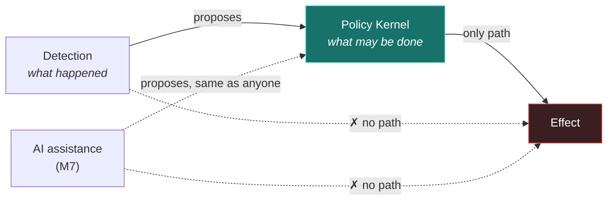

# Safety model

Automated response is the most dangerous feature a defence platform can have.
Every containment action that stops an attacker is the same action that locks out
a real person when the read was wrong — and the read is wrong more often than
anyone likes to admit.

This document states what GRIEFER is allowed to do, on what evidence, and what
happens when it is wrong.

---

## The core separation

**The component that decides what happened is never the component that decides
what may be done.**



This is not a coding convention. `internal/correlation` does not import
`internal/policy` and has no reference to any actuator. It produces
`RecommendedAction` values and stops. A detection engine that could reach an
effect would be a system capable of convincing itself, and a system that can
convince itself has no safety property at all.

## Autonomy levels

| Level | Name | What GRIEFER may do | Status |
|---|---|---|---|
| **L0** | Observe | Ingest, correlate, score, recommend. No effect of any kind. | ✅ v0.1 |
| **L1** | Simulate | Compute and display what an action *would* do. Still no external contact. | ✅ v0.1 |
| **L2** | Propose | Present an action for a human to approve, with a one-click path. | → M3 |
| **L3** | Act with veto | Execute after a delay, during which a human can cancel. | → M3 |
| **L4** | Act on corroboration | Execute reversible, non-critical actions immediately when the evidence bar is met. | → M6 |
| **L5** | Act broadly | Not planned. Included to state that it is not the destination. |  |

**v0.1 is L1.** The API accepts `mode: execute` so that the policy contract is
exercised end to end, and the policy always resolves it to `require_approval`.
Beyond that, `applyDecision` has a hard stop:

```go
case policy.EffectAllow:
    if action.Mode != incidents.ModeSimulate {
        // Unreachable while the policy requires approval for every execute
        // request. Kept as a hard stop: GRIEFER v0.1 ships no actuator, and a
        // future policy change must not silently turn this into execution.
        action.Status = incidents.ActionRequiresApproval
        return
    }
```

Two independent barriers — the policy and the code — so a policy edit alone
cannot promote the platform to a level it has no actuator for.

## The seven rules

Each rule states the failure it prevents, where it lives, and what proves it.

### 1. A single weak signal cannot trigger automated containment

*Prevents:* one forged or misread event locking out a real employee.

Isolation-class actions have their own rule, on top of the general corroboration
requirement, because their false-positive cost is the highest.

`policies/rego/griefer/response.rego` · `TestSafetyContract_SingleWeakSignalDoesNotIsolate`

### 2. Automated response requires two independent evidence categories

*Prevents:* one noisy detection driving action by firing repeatedly.

Categories are the unit, not findings. Ten sign-in anomalies for one identity are
one observation restated, and the policy counts *distinct* categories:

```rego
evidence_categories := {c | some c in input.incident.evidence_categories}
```

Risk scoring applies the same principle independently — within-category
repetition is capped at +50% — so the two mechanisms agree rather than one
undermining the other.

`TestSafetyContract_CorroboratedChainProducesHighRisk` · `TestAssessDoesNotManufactureConfidenceFromRepetition`

### 3. Destructive actions are denied unconditionally

*Prevents:* GRIEFER destroying evidence or access that cannot be recovered — and,
specifically, an attacker using GRIEFER to do it.

Not "requires approval". **Denied**, in every mode, to everyone, with no path to
override through this API. Deleting an identity or wiping an endpoint is an
out-of-band decision for a human with a different tool.

`delete_identity`, `wipe_endpoint` and `purge_audit_records` exist in the catalog
*so that* the deny path is exercised by real requests rather than a test double.

`TestSafetyContract_DestructiveActionsAreAlwaysDenied` — every destructive action ×
every mode × automated and human.

### 4. An action with no rollback requires human approval

*Prevents:* an irreversible mistake made at machine speed.

"Reversible" means a rollback action exists, and the catalog is the only thing
that may assert it. `revoke_sessions` is instructive: it is low-harm — the user
simply signs in again — but a revoked token cannot be un-revoked, so it is
honestly marked irreversible and needs a human.

The catalog invariant is itself tested: an action cannot claim reversibility with
an empty `RollbackAction`.

`TestCatalogInvariants` · `TestSafetyContract_IrreversibleActionsRequireHumanApproval`

### 5. An action on a critical asset requires human approval

*Prevents:* automated action against exactly the systems where being wrong is
most expensive.

Criticality comes from the operator's asset inventory, resolved through the
Security Graph — never from the request. An action that is not among the engine's
recommendations still resolves against the incident's most critical entity, so
the rule cannot be dodged by asking for an unrecommended action.

`TestSafetyContract_CriticalAssetActionsRequireHumanApproval`

### 6. Dry-run may proceed automatically

*Enables:* the platform being useful at L1. Simulation has no external effect, so
it may run whenever nothing above fires.

This is the only rule that grants rather than restricts, and it is the reason the
demo shows real verdicts instead of a permanently empty screen.

### 7. Every decision carries a human-readable reason

*Prevents:* an unexplainable action — which is an unauditable one.

Enforced twice. In Rego, a decision that somehow produced no reason substitutes an
explicit fallback rather than emitting an empty list. In Go, `toDecision` rejects a
decision with no reasons, which becomes a fail-closed denial.

Reasons are written for an analyst at 3 a.m., not for a log parser:

> Action "rotate_exposed_secret" is not reversible. An action that cannot be undone
> requires an explicit human decision. Action targets an asset classified critical.
> Critical assets always require human approval.

`test_every_decision_carries_a_reason` (Rego) · `TestEmbeddedKernelEnforcesTheSafetyRules` (Go)

## Fail-closed and fail-safe

These pull in opposite directions, and GRIEFER applies each where it belongs.

| Subsystem | Behaviour on failure | Why |
|---|---|---|
| **Policy Kernel** | **Fail closed** — deny everything | An unreachable authority is not permission |
| **Telemetry ingestion** | **Fail safe** — keep accepting and storing | Blinding the recorder is an attack; refusing to record helps the attacker |
| **Correlation** | **Fail safe** — degrade analysis, keep recording | A crashed rule must not stop capture |
| **Event bus** | **Fail safe** — publish is best effort | Fan-out is not the system of record |
| **Storage** | **Fail closed** — reject the event with 500 | An event GRIEFER cannot durably store must not be acknowledged |
| **Audit write** | **Loud, caller decides** | Whether an operation may proceed without its record depends on the operation |

The audit row deserves a note. `recordAudit` logs a write failure at ERROR rather
than aborting a completed operation, because turning a safe, finished operation
into a client-visible 500 does not un-perform it — it just hides it. A missing
audit entry is visible as a sequence gap in PostgreSQL and as an error in the log.

## Rollback

Every non-destructive action in the catalog either names its inverse or is marked
irreversible. There is no third state.

| Action | Reversible | Rollback |
|---|---|---|
| `preserve_evidence` | yes | `release_evidence_hold` |
| `require_mfa` | yes | `remove_mfa_requirement` |
| `temporarily_suspend_privileges` | yes | `restore_privileges` |
| `isolate_endpoint` | yes | `release_endpoint_isolation` |
| `revoke_sessions` | **no** | — the user re-authenticates |
| `rotate_exposed_secret` | **no** | — the previous value is gone |

Simulated actions already describe their rollback plan, so the shape is exercised
before it matters:

> Would place 1 endpoint-linked entities into network isolation, management channel
> retained. — *Run "release_endpoint_isolation" to reverse this action.*

**M3 requirements for real rollback:**

1. Every executed action records the prior state precisely enough to restore it.
2. Rollback is itself an action, policy-evaluated and audited.
3. Rollback of a reversible action never requires approval — undoing a mistake
   must be faster than making one.
4. Rollback is idempotent.
5. A failed rollback pages a human immediately.

## Break-glass

When GRIEFER is wrong and someone needs their access back *now*, the answer must
never be "wait for the platform".

**Design requirements for M3:**

| Requirement | Rationale |
|---|---|
| A single control stops all automated response, immediately | The first thing anyone reaches for when automation misfires |
| It works when the Policy Kernel is down | A control that depends on the failing component is not a control |
| It works from outside the console | The console may be part of the problem |
| Engaging it is itself audited | Including who and when |
| Protected identity classes can never be automatically contained | Break-glass accounts, incident responders, executives |
| Re-enabling requires an explicit action | It never times out back on by itself |

*Not implemented in v0.1.* It is not needed — nothing can act — and building it
before there is anything to stop would mean shipping an untested emergency
control, which is worse than none.

## Decision logging

Every Policy Kernel decision produces an audit entry containing the inputs, the
verdict, the reasons, the policy version, and which kernel produced it:

```json
{
  "sequence": 12,
  "timestamp": "2026-08-23T12:01:08.587405Z",
  "actor": "system:griefer",
  "action": "policy.evaluated",
  "subject_type": "action",
  "subject_id": "act-01a02e7e-f9ea-7816-8f2b-6a46ff694dc0",
  "outcome": "success",
  "reason": "Action \"preserve_evidence\" is non-destructive and reversible via \"release_evidence_hold\", corroborated by 5 independent evidence categories at risk score 81, and runs in \"simulate\" mode.",
  "details": {
    "action_type": "preserve_evidence",
    "effect": "allow",
    "engine": "embedded",
    "policy_version": "0.1.0",
    "fail_closed": false,
    "destructive": false,
    "reversible": true,
    "rollback_action": "release_evidence_hold",
    "targets_critical": false,
    "risk_score": 81,
    "evidence_types": ["authentication", "cloud_access", "credential_access",
                       "privilege_escalation", "session_anomaly"]
  }
}
```

Enough to reconstruct the decision without access to the original incident — which
is the test of whether an audit entry is worth writing.

Audit entries must never carry credential material or raw telemetry. Identifiers,
verdicts and counts only.

### Tamper-evidence — the honest position

**The chain detects alteration. It does not prove authenticity, because it is
stored beside the thing it protects.**

What exists:

- `audit.Sink` has no update and no delete. `TestSinkExposesNoMutationMethods`
  fails if anyone adds one.
- A PostgreSQL trigger raises on `UPDATE` and `DELETE`, proven against a real
  database by `TestPostgresAuditLogRejectsUpdateAndDelete`.
- Database-assigned sequence numbers make a removed row a visible gap.
- Each entry carries `prev_hash` and `entry_hash`: SHA-256 over the entry's
  canonical serialisation together with its predecessor's hash.
- `GET /api/v1/audit/verify` walks the chain and reports the first broken link.
  Its linkage check covers the whole chain; its content check — the one that
  catches an entry edited without rehashing — covers a bounded window, newest
  first, and reports the range it examined. Sweeping older pages is a deliberate
  act, described in the runbook.

What that is worth, stated precisely. `verify` answers *is this trail internally
consistent*, not *is this trail the one GRIEFER wrote*. The hash function and the
canonical form are both in this repository and no secret enters the computation,
so a role that can write to `audit_log` can alter an entry, recompute every hash
after it, and `verify` will report the result intact.

So the chain is evidence against everything that does not rewrite the whole
suffix — a single `DELETE`, a targeted deletion, an insert into the past, a
divergent restore, storage corruption — and it raises the cost of the remaining
case from one statement to a full-table rewrite.

A single `UPDATE` that leaves the stored hashes alone is in that set with one
qualification worth stating rather than burying: it breaks no *link*, so it is
caught by the content check, and the content check runs over a bounded window.
`verify` finds it immediately while the altered row is recent, and further back
it has to be swept for, page by page. The row stays altered and stays findable;
what is bounded is how much one call recomputes. The response says which
sequence range it examined, and warns when that was less than the whole chain. It is not evidence
against the database role itself. One thing survives even that: an `entry_hash`
recorded anywhere outside this database disagrees with the rewritten chain, so a
single exported page is enough to catch it. That is a real property and a thin
one, because it depends on someone having kept a copy.

Four limits follow from the mechanism and are not fixed by more hashing:

- A trail truncated to empty is consistent, because an empty chain is a valid
  chain. Removing a prefix *is* caught — the oldest surviving entry names a
  predecessor that is not there — but removing everything is not. `verify`
  reports `empty` rather than `consistent` so the two cannot be confused.
- A trail with its tail removed is a shorter chain whose every link checks out.
  `audit_chain_head` records the head inside the same transaction as the append,
  so `verify` reports a head that is ahead of the trail — but anyone who can
  delete the rows can also rewrite that row. It catches accident and partial
  restore, not an adversary.
- An entry *added* at the end is not detectable at all. The canonical form is in
  this repository and no secret enters it, so anyone who can `INSERT` can compute
  a well-formed link onto the current head, and the chain continues over it. The
  chain says the trail has not been broken; it does not say every entry in it was
  written by GRIEFER. Producer authentication and per-caller credentials are what
  would speak to that, and both are later milestones.
- The chain constrains the entries that were written. An entry that was never
  written leaves no gap in it, so the best-effort persistence path in
  [`docs/security/AUDIT_MODEL.md`](security/AUDIT_MODEL.md) is exactly as visible
  as it was before. The chain proves the trail is uninterrupted, not that it is
  complete.
- Rows written before M4 carry no hashes and never will. Backfilling them would
  require an `UPDATE` — dropping the very trigger being strengthened — and would
  attest to nothing about the past. They are reported as `unchained`, which means
  covered by neither check.

**Still M4:** periodic anchoring of the chain head to append-only external
storage. Comparing the head against a value the database role cannot reach is
what turns *consistent* into *unaltered*. Until it lands, do not call this trail
tamper-evident without saying against whom.

The decision, its cost and the alternatives are in
[ADR 0007](adr/0007-hash-chained-audit-without-anchor.md). How to read a
verification result at three in the morning — including which answers are boring
and which are not — is in
[the triage runbook](operations/AUDIT_CHAIN_RUNBOOK.md).

## AI and executive authority

The line, stated before there is any AI to hold to it:

| AI may | AI may never |
|---|---|
| Summarise evidence into a narrative | Decide whether an action is permitted |
| Propose hypotheses | Approve its own proposal |
| Rank what to investigate first | Modify policy |
| Draft a report | Modify an audit entry |
| Suggest an action for policy evaluation | Hold a credential an actuator accepts |

Structurally, an AI component is a client of the Policy Kernel with the same
standing as a human operator, and lower standing than one for anything requiring
approval. Its inputs are attacker-influenced: incident data contains
attacker-controlled strings, so the control-plane guard that exists today is a
prerequisite for M7, not an afterthought.

## Verification

The safety contract has its own suite. It should be readable as the guarantee
itself:

```bash
go test -run TestSafetyContract ./tests/integration/ -v
opa test policies/rego -v
```

| Guarantee | Test |
|---|---|
| Single weak signal cannot isolate | `TestSafetyContract_SingleWeakSignalDoesNotIsolate` |
| Corroborated chain reaches high risk and may act | `TestSafetyContract_CorroboratedChainProducesHighRisk` |
| Destructive always denied | `TestSafetyContract_DestructiveActionsAreAlwaysDenied` |
| Irreversible needs a human | `TestSafetyContract_IrreversibleActionsRequireHumanApproval` |
| Critical asset needs a human | `TestSafetyContract_CriticalAssetActionsRequireHumanApproval` |
| Unreachable kernel blocks everything | `TestSafetyContract_UnreachablePolicyKernelBlocksAllActions` |
| Invalid events never reach correlation | `TestSafetyContract_InvalidEventsNeverReachCorrelation` |
| Oversized payloads refused | `TestSafetyContract_OversizedPayloadsAreRejected` |
| Telemetry cannot inject commands | `TestSafetyContract_TelemetryCannotInjectCommands` |
| Unknown action types rejected | `TestSafetyContract_UnknownActionTypesAreRejected` |
| Every decision audited | `TestSafetyContract_EveryPolicyDecisionIsAudited` |
| Nothing is ever executed | `TestSafetyContract_NothingIsEverExecuted` |

A change that weakens any of these needs an ADR explaining why, not just a
passing build.
